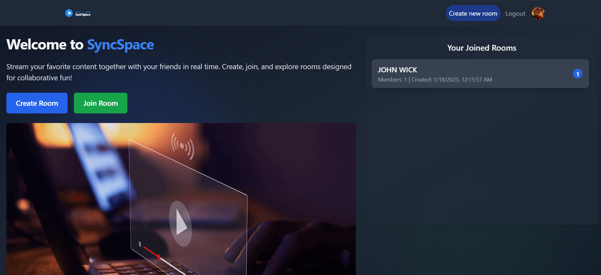
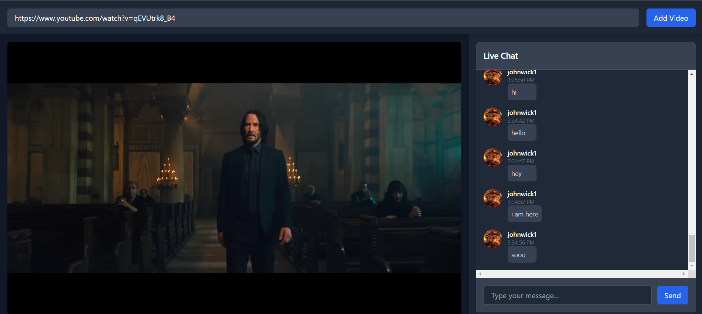

# SyncSpace Project

---

## **Table of Contents**

- [Overview](#overview)
- [Features](#features)
- [Architecture](#architecture)
- [Technologies Used](#technologies-used)
- [Controllers and API Functionality](#controllers-and-api-functionality)
- [Testing](#testing)
- [Authentication and Security](#authentication-and-security)
- [SignalR Streaming and Chatting](#signalr-streaming-and-chatting)
- [Setup and Deployment](#setup-and-deployment)
- [Contribution Guidelines](#contribution-guidelines)

---

## **Overview**




**SyncSpace** is a robust social media platform developed using **.NET 9.0**, designed to enable seamless communication and interaction. It incorporates:

- **Clean Architecture principles** for maintainability.
- Advanced features like **CQRS**, **MediatR**, and **SignalR** for real-time communication.
- **JWT authentication** for secure access and refresh tokens for extended sessions.

> **Why SyncSpace?**
> This project showcases scalable system design while prioritizing performance and security.

---

## **Features**

### ✨ Key Highlights:

- 🔐 **User Authentication**: Secure login and token-based access.
- 💬 **Chat Rooms**: Real-time chat functionality with SignalR.
- 🎥 **Streaming**: Real-time video synchronization in chat rooms.
- 📚 **Clean Code**: Based on Clean Architecture principles.
- 🔧 **Comprehensive Logging**: Debug-friendly with Serilog.
- ✅ **Testing**: Fully tested with xUnit framework.

---

## **Architecture**

**Clean Architecture** is at the heart of SyncSpace

### 🔧 Layers:

1. **Core Layer**:
   - Business logic
   - Domain entities
2. **Application Layer**:
   - Implements **CQRS** with **MediatR**
   - Validation using **FluentValidation**
3. **Infrastructure Layer**:
   - Repository patterns and Unit of Work
4. **API Layer**:
   - Exposes RESTful endpoints

### Patterns Used:

- **CQRS with MediatR**: Separation of read/write operations.
- **Repository Pattern with Unit of Work**: Encapsulation of data access logic.
- **Dependency Injection**: Easy maintainability and testing.

---

## **Technologies Used**

| Technology           | Purpose                       |
| -------------------- | ----------------------------- |
| **.NET 9.0**         | Framework for the application |
| **C#**               | Core programming language     |
| **SignalR**          | Real-time communication       |
| **JWT**              | Secure authentication         |
| **FluentValidation** | Input validation framework    |
| **xUnit**            | Unit testing framework        |
| **Serilog**          | Logging and debugging         |
| **Swagger**          | API documentation             |

---

## **Controllers and API Functionality**

### 🔑 **AuthController**

| Method | Endpoint        | Description                    |
| ------ | --------------- | ------------------------------ |
| `POST` | `/register`     | Registers a new user           |
| `POST` | `/login`        | Authenticates and issues a JWT |
| `GET`  | `/refreshToken` | Refreshes a JWT using cookies  |

---

### 🔧 **ChatController**

| Method | Endpoint    | Description                                |
| ------ | ----------- | ------------------------------------------ |
| `POST` | `/`         | Sends a message and broadcasts it          |
| `GET`  | `/{roomId}` | Retrieves chat history for a specific room |

---

### 🏢 **RoomController**

| Method   | Endpoint                 | Description                 |
| -------- | ------------------------ | --------------------------- |
| `POST`   | `/new`                   | Creates a new chat room     |
| `PUT`    | `/update`                | Updates room details        |
| `DELETE` | `/{roomId}`              | Deletes a room              |
| `POST`   | `/{roomId}/{userId}/add` | Adds a user to a room       |
| `POST`   | `/{roomId}/join`         | Joins a user to a room      |
| `POST`   | `/{roomId}/leave`        | Removes a user from a room  |
| `GET`    | `/`                      | Fetches all available rooms |
| `GET`    | `/{roomId}`              | Retrieves room details      |

---

### 🎥 **StreamController**

| Method | Endpoint | Description                   |
| ------ | -------- | ----------------------------- |
| `POST` | `/`      | Starts a new stream in a room |
| `PUT`  | `/`      | Changes the stream URL        |

Additional endpoints handle syncing, pausing, and resuming streams.

---

## **Testing**

- **Framework**: xUnit
- **Coverage**:
  - Unit tests for commands and queries.
  - SignalR message broadcasting.
  - FluentValidation rule tests.

---

## **Authentication and Security**

- **JWT Tokens**: Stateless authentication.
- **Refresh Tokens**: Secure token refresh with cookies.
- **Role-Based Authorization**: Protects API endpoints.

---

## **SignalR Streaming and Chatting**

- Real-time communication with SignalR hubs.
- Broadcasts messages to chat room groups.
- Stream synchronization features (start, pause, resume).

---

## **Setup and Deployment**

### ⚙ Prerequisites:

- **.NET 9.0 SDK** installed.
- Database setup (e.g., SQL Server).

### 📝 Steps:

1. **Clone Repository**:
   ```bash
   git clone <repository-url>
   ```
2. **Restore Dependencies**:
   ```bash
   dotnet restore
   ```
3. **Database Migration**:
   Update the connection string in `appsettings.json` and run:
   ```bash
   dotnet ef database update
   ```
4. **Run Application**:
   ```bash
   dotnet run
   ```
5. Access **Swagger UI** at:
   ```
   http://localhost:<port>/swagger
   ```

---

## **Contribution Guidelines**

We welcome contributions! 🚀

1. **Fork Repository**: Create your feature branch.
2. **Document and Test**: Ensure changes are well-documented and tested.
3. **Submit Pull Request**: Describe your changes in detail.

---
